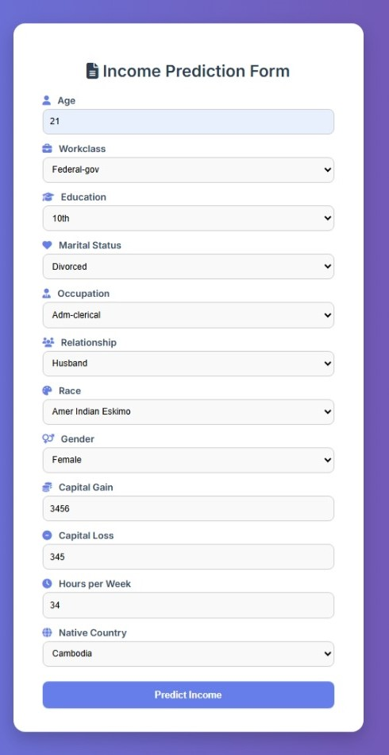

# 💰 Income Prediction Web Application

A user-friendly web application that predicts whether a person's income exceeds $50K based on demographic and work-related inputs using a trained Machine Learning model (Decision Tree Classifier).

---

## 🛠️ Tech Stack

| Category        | Tools / Libraries                       |
|----------------|------------------------------------------|
| 👨‍💻 Backend     | Python, Flask                            |
| 📊 ML Model     | Scikit-learn (DecisionTreeClassifier)    |
| 🎨 Frontend    | HTML5, CSS3, Font Awesome, Google Fonts |
| 🔍 Data         | UCI Adult Census Income Dataset          |

---

## 🚀 Features

✅ Predicts income class (`>50K` or `<=50K`) based on:
- Age
- Workclass
- Education
- Marital Status
- Occupation
- Relationship
- Race
- Gender
- Capital Gain/Loss
- Hours per week
- Native Country

✅ Attractive, responsive frontend design

✅ Real-time predictions with form submission

✅ Clean, animated UI with icons and validation

---

## 📷 Screenshots

### 📝 Form Interface

### 📊 Prediction Result

---

